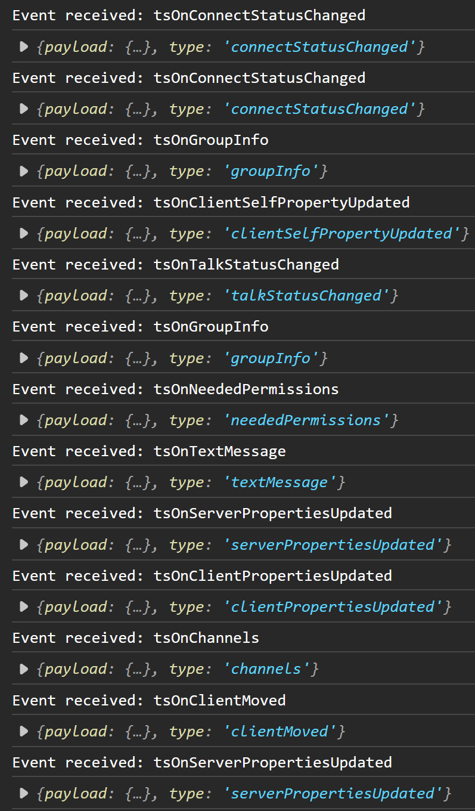
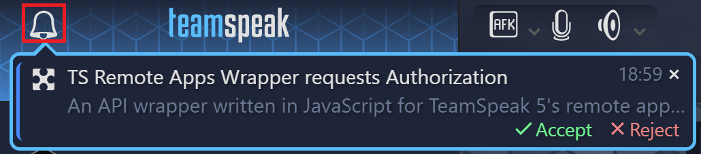
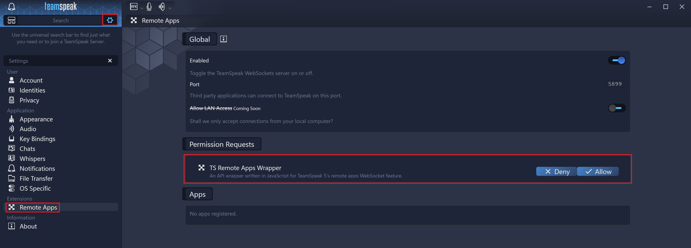

# ts5-remote-apps-wrapper
A front end API wrapper written in JavaScript for TeamSpeak 5's remote apps WebSocket feature<br />
<br />

[](https://opensource.org/licenses/MIT)

# Table of contents

- [ts5-remote-apps-wrapper](#ts5-remote-apps-wrapper)
- [Table of contents](#table-of-contents)
- [Setting up ts5-remote-apps-wrapper](#setting-up-ts5-remote-apps-wrapper)
- [Usage](#usage)
  - [Basic information](#basic-information)
  - [Connecting without API key](#connecting-without-api-key)
  - [Connecting with existing API key](#connecting-with-existing-api-key)
  - [Basic connection example](#basic-connection-example)
- [Config](#config)
  - [How to pass options](#how-to-pass-options)
  - [Available options](#available-options)
- [Events](#events)
  - [API](#api)
    - [List of events](#list-of-events)
  - [TeamSpeak](#teamspeak)
    - [Show captured events](#show-captured-events)
    - [List of commonly used events](#list-of-commonly-used-events)
- [Methods](#methods)
- [TeamSpeak client](#teamspeak-client)
  - [Permission prompt](#permission-prompt)

# Setting up ts5-remote-apps-wrapper
1. Download the latest version of the bundled library file [here](dist/ts5-remote-apps-wrapper.min.js).
2. Import script in your front end
```html
<script type="text/javascript" src="ts5-remote-apps-wrapper.min.js"></script>
```
3. You can now access the API wrapper by instantiating it's class as follows
```javascript
new TSRemoteAppWrapper.TSApiWrapper();
```

# Usage

## Basic information
When connecting to the TeamSpeak client API, an API key is used to identify the application that is trying to access the API. The API key is generated upon the first connection (given an empty API key is passed in the config on the first connection) after the user has accepted the [permission prompt](#permission-prompt) in the TeamSpeak client settings.

It is best to store the API key for future connections as this prevents the user from having to accept the [permission prompt](#permission-prompt) again in the future.

## Connecting without API key
> **NOTE:** The example below stores the generated API key in a variable. In most cases you'll probably want to store it somewhere more persistant, like a cookie.
```javascript
// Variable used to store the API key
var apiKey = "";

var api = new TSRemoteAppWrapper.TSApiWrapper();

// Once API is connected store generated API key for future connections
api.on('apiReady', (data) => {
    apiKey = data.payload.apiKey;
});

// Show errors in console
api.on('apiError', (data) => {
    console.log(data.exception.message);
});
```

## Connecting with existing API key
> **NOTE:** You can only use API keys generated by the API as described under "[Basic information](#basic-information)".<br/>
> Using custom or self generated API keys will result in an authentication error.

```javascript
var apiKey = "a89e9a63-170e-459d-985a-b83d616910cb";

var api = new TSRemoteAppWrapper.TSApiWrapper({
    api: {
        key: apiKey
    }
});
```

## Basic connection example
For a basic connection example using cookies to store the API key see [example/index.html](example/index.html);

# Config
## How to pass options
Custom config values can be passed during instantiation of the `TSApiWrapper` object:
```javascript
var customConfig = {
    api: {
        key: apiKey,
    },
    app: {
        identifier: 'test-app',
        name: 'Test app',
        description: 'Test app for TS API'
    }
}

var api = TSRemoteAppWrapper.TSApiWrapper(customConfig);
```

## Available options

| Option             | Description                                                                                 | Default value                                                                           | Var type  |
| ------------------ | ------------------------------------------------------------------------------------------- | --------------------------------------------------------------------------------------- | --------- |
| `api.host`         | IP address or hostname to connect to                                                        | `localhost`                                                                             | `string`  |
| `api.port`         | Port to connect to                                                                          | `5899`                                                                                  | `integer` |
| `api.key`          | API key used to authenticate on initial connection                                          | ` `                                                                                     | `string`  |
| `api.tsEventDebug` | Show incoming TeamSpeak client events and the corresponding event data in console           | `false`                                                                                 | `boolean` |
| `app.name`         | Name of the app connecting to API. (Used in [permission prompt](#permission-prompt))        | `TS Remote Apps Wrapper`                                                                | `string`  |
| `app.identifier`   | Identifier of the app connecting to API                                                     | `ts5-remote-apps-wrapper`                                                               | `string`  |
| `app.version`      | Version of the app connecting to API                                                        | `1.0.0`                                                                                 | `string`  |
| `app.description`  | Description of the app connecting to API. (Used in [permission prompt](#permission-prompt)) | `An API wrapper written in JavaScript for TeamSpeak 5's remote apps WebSocket feature.` | `string`  |

# Events
You can attach event handlers to any event using the `on()` function:
```javascript
api.on(eventName, callback);
```
## API
API events are events that are specific to the API connection. These events are generated by the API wrapper.<br/>
Examples are: Failure to connect to API, closing of API connection etc. 

### List of events
| Event                | Description                                                                                      | Callback parameter value                                                                         |
| -------------------- | ------------------------------------------------------------------------------------------------ | ------------------------------------------------------------------------------------------------ |
| `apiConnectionClose` | Called when the API connection is closed                                                         | Original WebSocket event                                                                         |
| `apiConnectionOpen`  | Called when the API connection is opened (before authentication)                                 | Original WebSocket event                                                                         |
| `apiError`           | Called when the API connection fails or closes unexpectedly                                      | `socketEvent` => Original WebSocket event <br/>`exception` => Exception that describes the error |
| `apiIncomingMessage` | Called when the API wrapper is receiving a message from the TeamSpeak client                     | Original WebSocket event                                                                         |
| `apiReady`           | Called when the API is authenticated and ready to transmit data to and from the TeamSpeak client | JSON Object returned by TeamSpeak client after authentication                                    |


## TeamSpeak
TeamSpeak events are events generated on the TeamSpeak client and forwarded to the API. <br/>
Examples would be: moving channels, connecting to a new server etc.

### Show captured events
An easy way to figure out and track events that are being captured by the API Wrapper is to enable the `api.tsEventDebug` [option](#available-options) when instantiating the API wrapper:
```javascript
var api = TSRemoteAppWrapper.TSApiWrapper({
    api: {
        tsEventDebug: true
    }
});
```
Once the API is connected successfully, every event that is triggered in the TeamSpeak client and it's corresponding data is logged to the console:<br/>
<br/>
<br/>
<br/>

### List of commonly used events
>
> **NOTE:** TeamSpeak events are generated dynamically according to the TeamSpeak client API messages.<br/>
> The list below is by no means complete and subject to change depending on TeamSpeak client updates.<br/>

| Event                         | Description                                                                                             |
| ----------------------------- | ------------------------------------------------------------------------------------------------------- |
| `tsOnAuth`                    | Called after the API wrapper sent an authentication request that was successful                         |
| `tsOnChannel`                 | Called after connecting to a server to give API info about available channels on newly connected server |
| `tsOnChannelEdited`           | Called after a channel was edited on server                                                             |
| `tsOnClientMoved`             | Called after moving to a different channel                                                              |
| `tsOnClientPropertiesUpdated` | Called after TeamSpeak client properties have changed (e.g.: microphone is muted)                       |
| `tsOnConnectStatusChanged`    | Called after connecting or disconnecting to/from server                                                 |
| `tsOnGroupInfo`               | Called after connecting to a server to give API info on groups available on newly connected server.                 |
| `tsOnLog`                     | Called when a new entry to the TeamSpeak client's log is made                                           |
| `tsOnTextMessage`             | Called when a chat message is received                                                                  |
| `tsOnTalkStatusChanged`       | Called after the talk status has changed                                                                    |

# Methods   
| Event                      | Description                                                                              | Parameters                                                                                                  | Return type | Possible exceptions                              |
| -------------------------- | ---------------------------------------------------------------------------------------- | ----------------------------------------------------------------------------------------------------------- | ----------- | ------------------------------------------------ |
| `connect()`                | Used to connect to API after disconnecting or connection was closed                      |                                                                                                             | `void`      |                                                  |
| `disconnect()`             | Disconnect from the API. (Should only be called after [apiReady event](#list-of-events)) |                                                                                                             | `void`      | `TSApiConnectionException`                       |
| `send(data)`               | Send JSON data to the API                                                                | `data` => JSON object to send to the API                                                                    | `void`      | `TSApiConnectionException`, `TSApiAuthException` |
| `on(eventName, callback)`  | Bind a custom callback function to [events](#events).                                    | `eventName` => Name of event to bind callback to<br/>`callback` => Function to execute when event is called | `void`      |                                                  |
| `off(eventName, callback)` | Remove a custom callback function that is bound to an [event](#events).                  | `eventName` => Name of event to remove callback from<br/>`callback` => Function to remove from event        | `void`      |                                                  |


# TeamSpeak client
## Permission prompt
Upon initializing the API connection to the TeamSpeak client, the user receives a permission prompt that needs to be confirmed for the API to work.<br/>
The prompt can be found either in TeamSpeak's notification tray:<br/>
<br/>
<br/>
<br/>
or under the "Remote Apps" settings:<br/>
<br/>
<br/>
<br/>
